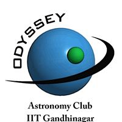
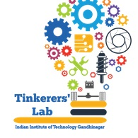

# Technical Clubs

The various Technical Clubs along with Tinkerers' Lab coordinate together to take initiatives and conduct activities round the year to further the technical quotient of IITGN and also make a difference to everyone around us.
Wish to join one? Wish to request a workshop or event? Do not hesitate to contact us!

## Metis

Coding Club, at IITGN aims at spreading knowledge related to computer programming to the students and also develop websites and applications that cater to the needs of the institute. The club arranges weekly workshops focusing on basic programming and designing languages like Java and html. To inculcate a coding culture in the institute, Hackathon nights are conducted.

Club Secretary:
E-mail : *coding@iitgn.ac.in*
Website: Link

## DigiS

DigiS is the digital sports development club of IIT Gandhinagar. It acts as a platform for creative thinkers to turn their imaginations into reality. The club intends to take human-technology interaction to a whole new level. The club develops simulations, applications, augmented reality platforms for android and OS systems. It organizes regular events where students of the institute can participate

Club Secretary:
E-mail : *digis@iitgn.ac.in*

## Mean Mechanics

Believing in the philosophy of "Learning through Application", the mean Mechanics club plays a crucial role in inspiring and creating curiosity towards robotics and mechanics. It organizes workshops and competitions throughout the year focusing on different aspects of engineering and giving hands on experience to participants.

Club Secretary:
E-mail : *meanmechanics@iitgn.ac.in*
Youtube : Mean Mechanics

## Odyssey

The universe is as vast as our imagination. The Odyssey club of IITGN attempts to foster the knowledge and participation of students of the institute in the field of astronomy. It encourages students across different disciplines and programmes to relive their passion to learn about the space and universe as a whole. The club provides students with technical learning and hands on experiences on astronomical equipments.

Club Secretary:
E-mail : *odyssey@iitgn.ac.in*

## Tinkerers' Lab

Tinkerers' Lab aims to set up a culture where students are not afraid to get their hands dirty, where students gain self-dependency, self-sufficiency and efficiency in experimentation, a culture where they can approach problems theoretically as well as practically and use the knowledge and experience gained in the process, to come up with something exceptional that could change the course of our future.

Overall Co-ordinator:
E-mail : *tinkererslab@iitgn.ac.in*
Website: Link
