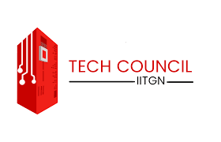

## About Us

Technical Council IITGN is the student body that promotes and takes initiatives for the technical activities that happen at IIT Gandhinagar. 

# Our mission
Technical Council strives hard to provide the students a platform to learn and critically understand the technologies that aids innovation and development, along with providing the resources that facilitates it.
# Our plan 
Consisting of four clubs of various domains, Tinkerers’ Lab and hobby groups that have been working on various genre of projects and activities, Technical Council strives to inculcate the culture of exploring and learning different fields.
# Our vision
We wish to create an environment that creates the future leaders in technology that make an impact on the world around us and also developing the culture that can facilitate doing so.

## Skills

Type | List
-----|-------|--------
Languages | English, Hindi, Odia
Tools & Technologies | HEC RAS, HEC HMS, Arc GIS, ENVI, ERDAS IMAGINE, ArcSWAT, MATLAB, Python, Autodesk Inventor
 

